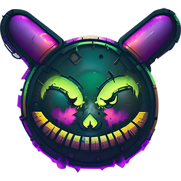
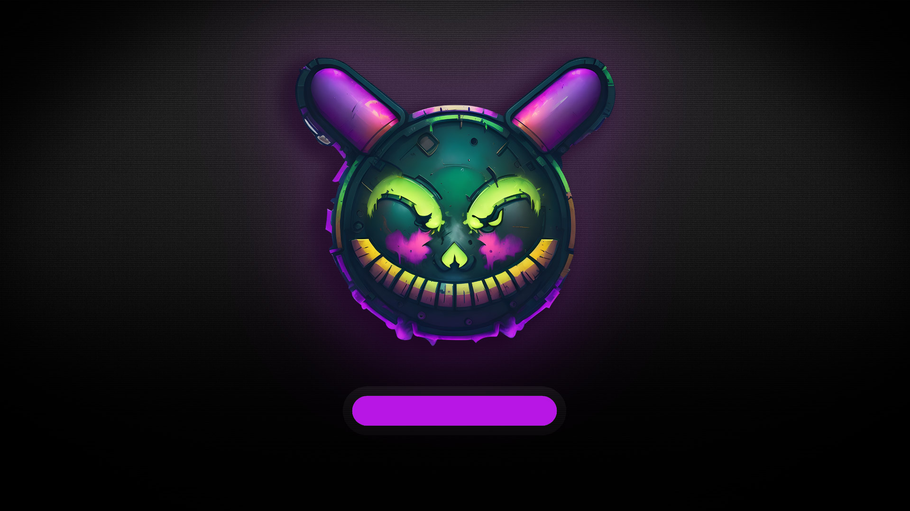
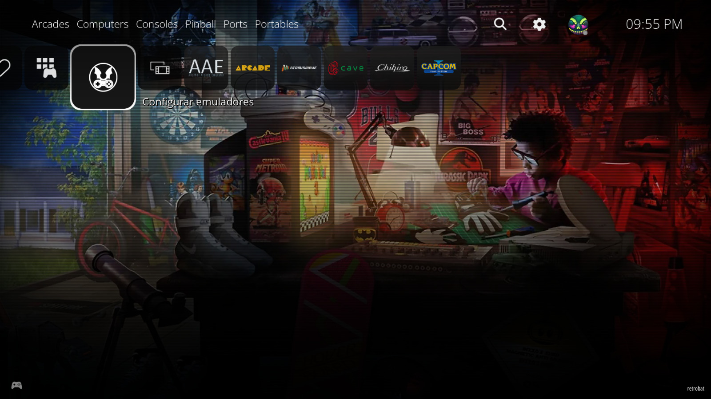
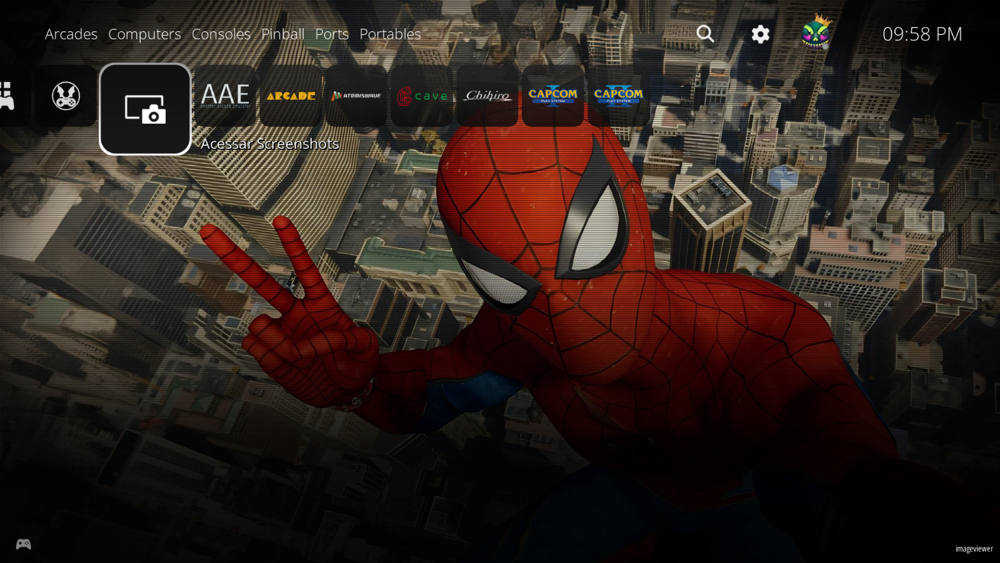

# RIESCADE Platforms (PS5 style)

Theme 'RIESCADE' Platforms v1.2 - 05-02-2024 by MarcoRiesco

based on interface Playstation 5 http://playstation.com/

for use with EmulationStation (http://www.emulationstation.org/) and Batocera V36+ (https://batocera.linux)

## License

Summary of the license below:

ALLOWED: - Share and duplicate as it is - Edit, alter, change it

REQUIREMENTS: - Attribution, give credit to the creator - Indicate changes to it - Publish the changes under the same license

PROHIBITED: - Commercial distribution

---

LOGO AND BACKGROUNDS NOTICE

The used logos and trademarks are copyright of their respective owners.

Midjourney backgrounds use is restricted to this template.

## Screenshots

## Credits

- [Google Fonts](https://fonts.google.com/specimen/Open+Sans)
- [Backgrounds AlekFull](https://github.com/fagnerpc)
- [Emulators Template (Retrobat)](https://github.com/fabricecaruso/es-theme-carbon)
